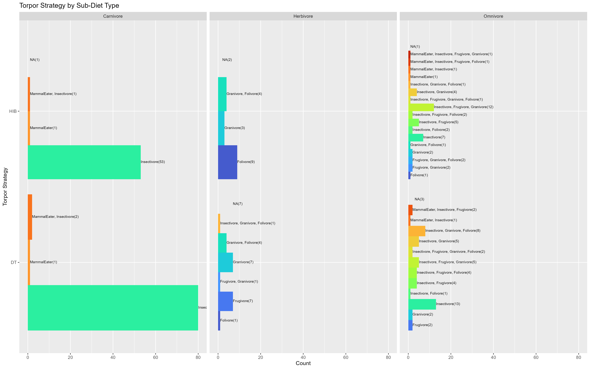

### DESCRIPTIONS OF ALL SCRIPTS

**## torpor strategies and activity pattern**
Figuring out if there is a connection between an animal's activity pattern (nocturnal/diurnal/crepuscular,etc.) and their ability to demonstrate dormancy
##files in this dataset
packages used- readxl, ggplot2, dplyr
data- excel file containing list of mammals which exhibit dormancy traits (torpor, hibernation, etc.)
result- contains bar plots, probability distribution graphs and statistical tests- chi sq. test, logistic regression using glm
##key findings
nocturnal species were over represented in the mammalian data, even when compared with non-dormant species
resampled the dataset (bootstrap= 1000, with replacement) to judge the stability of dormancy rates wrt activity pattern 
odds of dormancy for baseline group cathemeral/crepuscular = 0.014 (low odds)
diurnals are 5.52x more likely to show dormancy as compared to baseline
nocturnals are 15.83x more likely to show dormancy as compared to baseline

**### heatmap of log body mass by latitude and torpor type**
Finding the connection between multiple biological parameters using a faceted heatmap 
###files in this dataset
packages used- readxl, ggplot2, dplyr, viridis
file1- excel file containing list of mammals which exhibit dormancy traits
file2- excel file containing the geographical location of the dormant species
result- heatmap faceted by activity patterns.
Y-axis shows different strategies, labelled DT= daily torpor HIB= hibernators and BO= both
X axis- each tile represents a species corresponding to their respective latitude bin and the position is a descriptor of torpor strategy used. The colour of the tile is an indicator of Body Mass.
###key findings
merged file1 and file2 using species name. Syntax in both files varied and some taxonomic names had been changed. Cleaned all of this and successfully used left_join
Nocturnals- widespread across all latitudes, multiple strategies and low-to-moderate body mass
Diurnals- Include some higher BM organisms performing HIB (solidifying the idea that higher BM is consistent with HIB than DT)
Cathemeral/Crepuscular- fewer data points, cluster around lower BM 

**##diet and dormancy**
Studying the association between diet and dormancy. Are certain diets more favourable for torpor/hibernation? Is there a fattening stage in mammals that preps them to endure dormant periods, thereby leaning them towards certain dietary categories? Are these traits conserved across orders?
###files in this dataset- readxl, ggplot2, dplyr, patchwork
full_data- dataset by Kissling. Contains diet information on all mammals (6625 species)
dormant_data- dataset which contains information on dormant mammals. Diet info. was not present...imported from Kissling dataset using left_join()
performed k means clustering to find out if there's significant grouping in TYPE, TrophicLevel and order according to BIO variables set by WorldClim database where BIO1= annual temp, BIO2= mean diurnal range, BIO4= seasonality. Faceted this information into top 5 Orders present in dormant mammal database (the codes for those are just simple scatter plots where shape i.e, circle= DT and triangle = HIB and colours correspond to diet, then proceeded with the clustering)
result-
plots: (stacked bar graphs)
1] comparison of Trophic Levels, all mammals vs dormant mammals
2] carnivory, omnivory and herbivory diet subtypes, all mammals vs dormant mammals
chi sq. test to test the statistical significance of distribution of Trophic levels in dormant vs non-dormant mammals
3] heatmap of residuals obtained from chi sq. test
Results:
Carnivory prevalent in dormant mammals when compared to all. Herbivory seen to be reduced. Statistical tests showed a significant p value...these residuals are worth noting. 
Insectivory despite being over represented, has a positive correlation to animal dormancy; possibly due to insects being a specialized diet form, leading to low food options during winters, morphological limitations, ecological niche constraints, high BMR, small size= rapid heat loss, etc.
% of dormant granivores found to be greater than insectivores. Points to grains being an energy-rich source, especially for herbivores as granivores are under represented in all mammals dataset but their high numbers in dormant mammals are worth noting.
Clustering didn't work...i want to perform a 2 way ANOVA

**###glm#####**
Using glm models to predict how ecological variables such as latitude, climate (bio variables by WorldClim) and NPP affect the diet of dormant mammals.
I want to account for phylogenetic regression in this as well
##i am currently working on this, i will write the conclusions, methodology and add the plots after i am done

