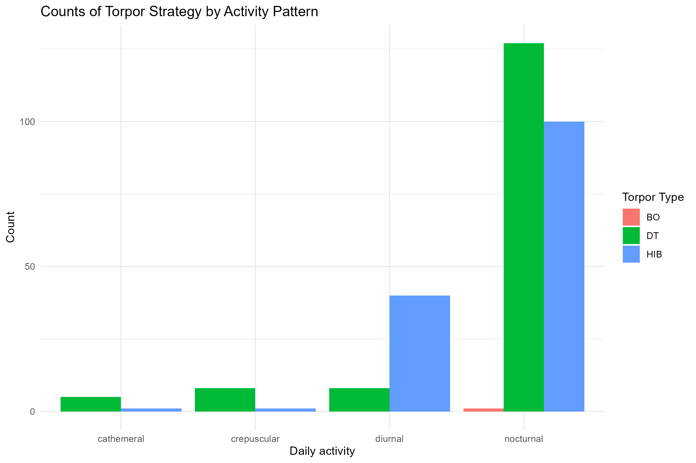
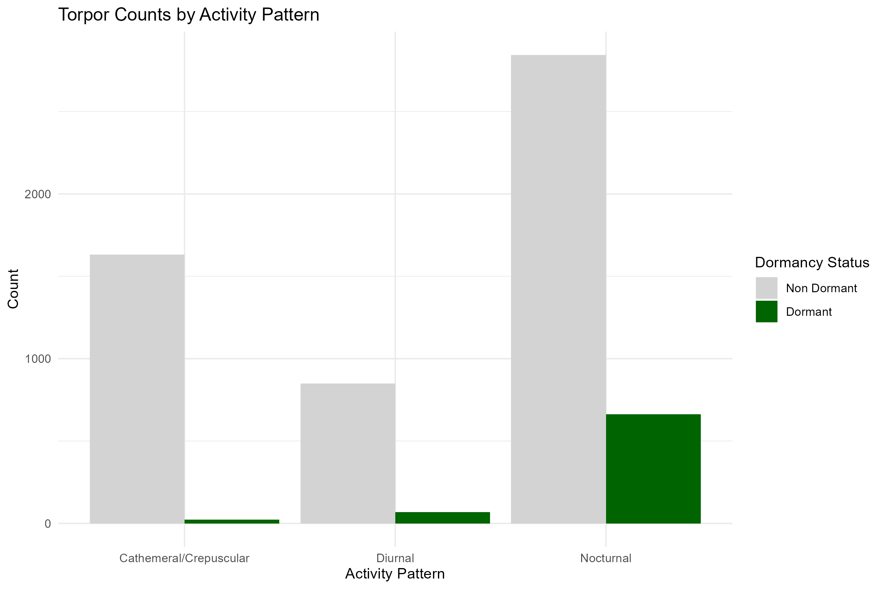
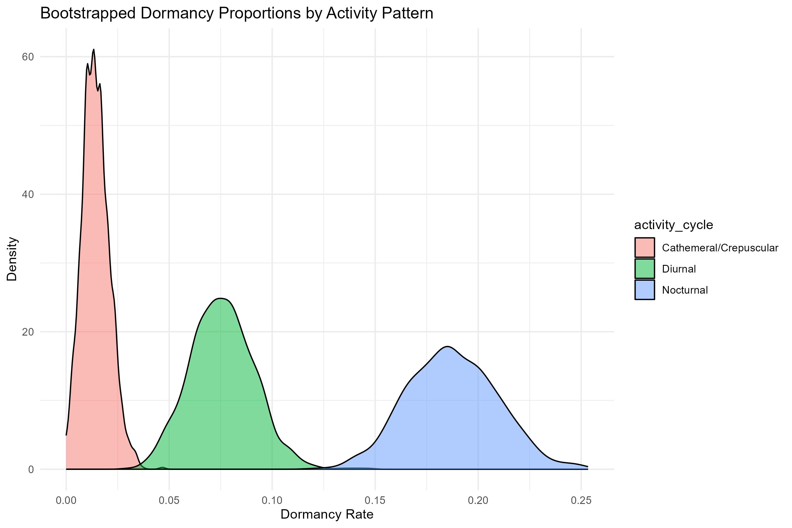
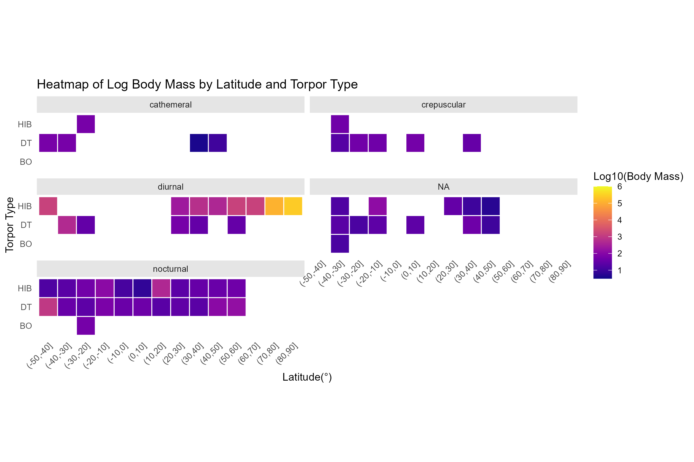

### DESCRIPTIONS OF ALL SCRIPTS

**## torpor strategies and activity pattern**
Figuring out if there is a connection between an animal's activity pattern (nocturnal/diurnal/crepuscular,etc.) and their ability to demonstrate dormancy
##files in this dataset
packages used- readxl, ggplot2, dplyr
data- excel file containing list of mammals which exhibit dormancy traits (torpor, hibernation, etc.)
result- contains bar plots, probability distribution graphs and statistical tests- chi sq. test, logistic regression using glm
##key findings
nocturnal species were over represented in the mammalian data, even when compared with non-dormant species
resampled the dataset (bootstrap= 1000, with replacement) to judge the stability of dormancy rates wrt activity pattern 
odds of dormancy for baseline group cathemeral/crepuscular = 0.014 (low odds)
diurnals are 5.52x more likely to show dormancy as compared to baseline
nocturnals are 15.83x more likely to show dormancy as compared to baseline

**### heatmap of log body mass by latitude and torpor type**
Finding the connection between multiple biological parameters using a faceted heatmap 
###files in this dataset
packages used- readxl, ggplot2, dplyr, viridis
file1- excel file containing list of mammals which exhibit dormancy traits
file2- excel file containing the geographical location of the dormant species
result- heatmap faceted by activity patterns.
Y-axis shows different strategies, labelled DT= daily torpor HIB= hibernators and BO= both
X axis- each tile represents a species corresponding to their respective latitude bin and the position is a descriptor of torpor strategy used. The colour of the tile is an indicator of Body Mass.
###key findings
merged file1 and file2 using species name. Syntax in both files varied and some taxonomic names had been changed. Cleaned all of this and successfully used left_join
Nocturnals- widespread across all latitudes, multiple strategies and low-to-moderate body mass
Diurnals- Include some higher BM organisms performing HIB (solidifying the idea that higher BM is consistent with HIB than DT)
Cathemeral/Crepuscular- fewer data points, cluster around lower BM 

